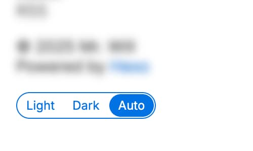

# Color Scheme

## Color scheme

Which color scheme to use, which should be one of `light`, `dark` and `auto`. Default value is `auto`.

```yml filename="_config.cupertino.yml"
color_scheme: auto
```

## Color scheme toggle

Show color theme toggle in footer.



```yml filename="_config.cupertino.yml"
show_color_scheme_toggle: true
```
