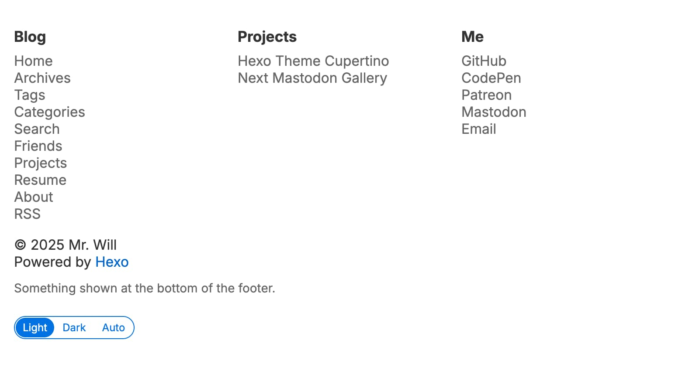

# Footer



## Links

By default, footer contains 3 columns of links, each column has a title. You can add or remove columns by adding or removing footer groups. There is no limitation on the total count of footer groups.

```yml filename="_config.cupertino.yml"
footer:
  - group_name: Blog
    items:
      - name: Home
        url: /
      - name: Archives
        url: /archives
      ...
      - name: RSS
        url: /atom.xml
  - group_name: Projects
    items:
      ...
  - group_name: Me
    items:
      - name: Email
        url: mailto:somebody@example.com
```

## Extra description

If you need to append your ICP license or some random words in footer, use `footer_extra_description`. This presents its value as it is.

```yml filename="_config.cupertino.yml"
footer_extra_description: Something shown at the bottom of the footer.
```
