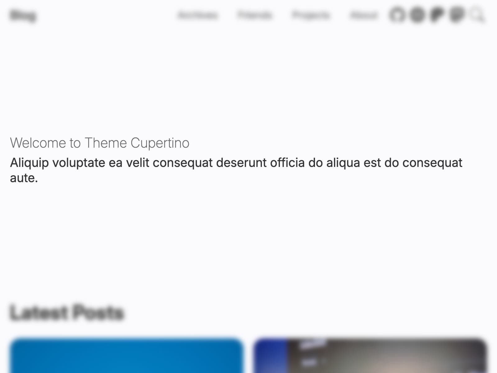

# Hero Section

The very first section in your blog's home page.



```yml filename="_config.cupertino.yml"
hero:
  title: Welcome to Theme Cupertino
  description: |
    Aliquip voluptate ea velit consequat deserunt officia do aliqua est do consequat aute.
```

`hero.description` allows multiline content and will keep the newlines.
