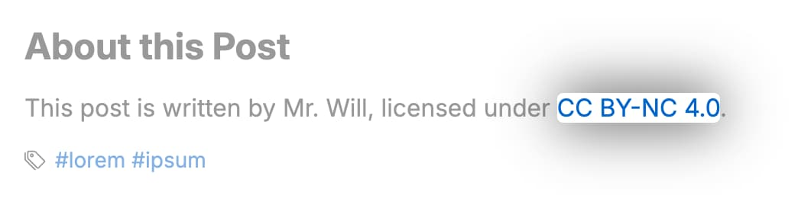

# License



The default license shown at the end of your post. Here is the default configuration as an example:

```yml filename="_config.cupertino.yml"
license: CC BY-NC 4.0
license_link: https://creativecommons.org/licenses/by-nc/4.0
```
