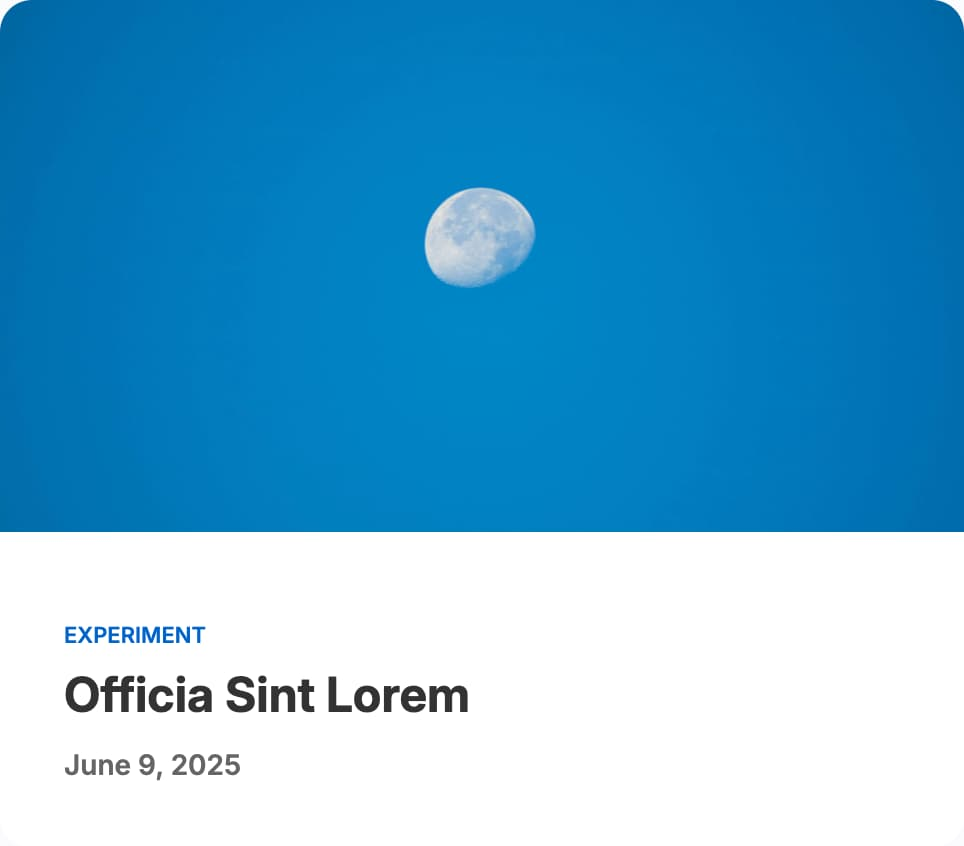
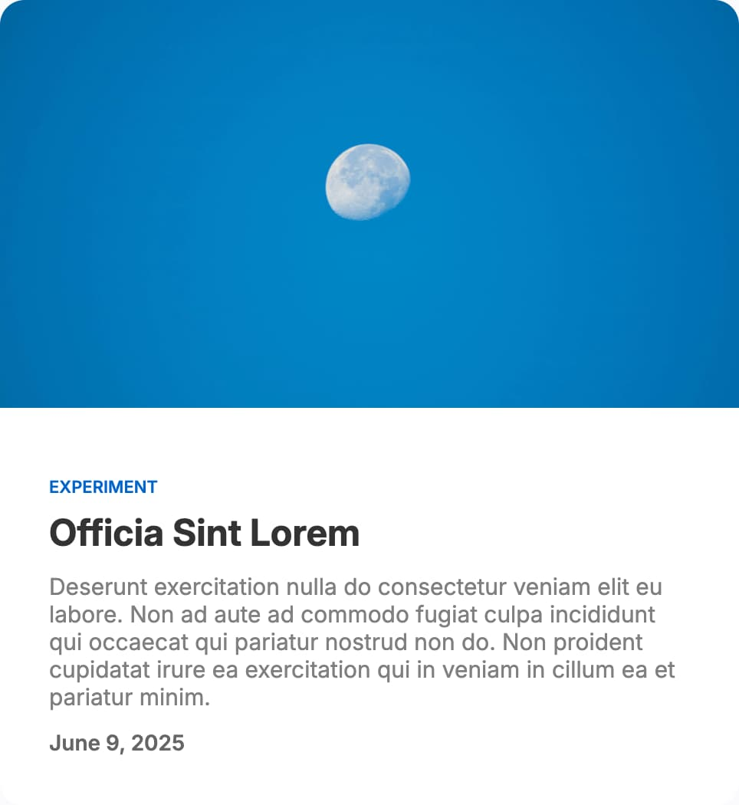
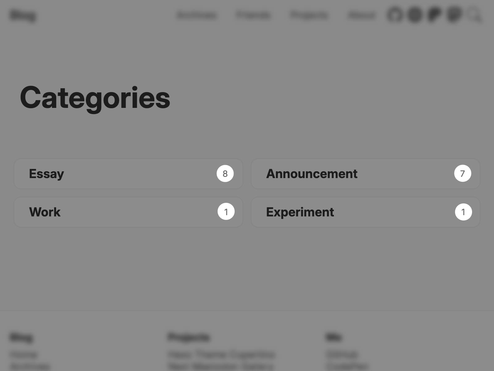
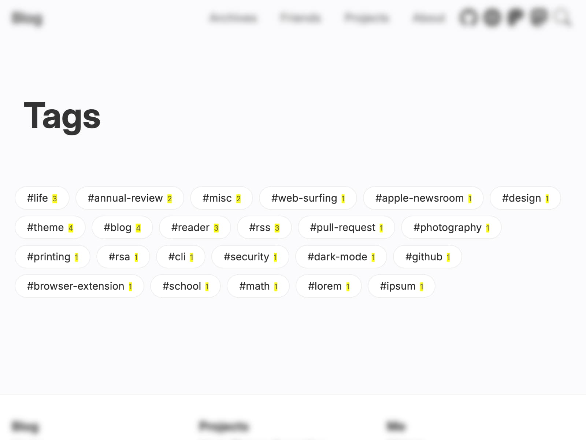

# Posts

## Excerpt

| Excerpt hidden                                                               | Excerpt shown                                                             |
| ---------------------------------------------------------------------------- | ------------------------------------------------------------------------- |
|  |  |

Excerpts are hidden by default. To enable it, set:

```yml filename="_config.cupertino.yml"
show_excerpt: true
```

## Tags & categories appearance

### Uppercase categories

Whether to make categories' names uppercase. This option will affect the categories shown in the post list, post page and more, except categories page.

```yml filename="_config.cupertino.yml"
uppercase_categories: true
```

### Categories post count



Whether to show post count on categories page.

```yml filename="_config.cupertino.yml"
categories_post_count: true
```

### Capitalize tags

Whether to make tags' names capitalized.

```yml filename="_config.cupertino.yml"
capitalize_tags: false
```

### Hashtag prefix before tags

Automatically add a hashtag prefix to tags' names.

```yml filename="_config.cupertino.yml"
hashtag_prefix_before_tags: true
```

### Tags post count

Those with yellow backgrounds are the post counts.



Whether to show post count on tags page.

```yml filename="_config.cupertino.yml"
tags_post_count: true
```
