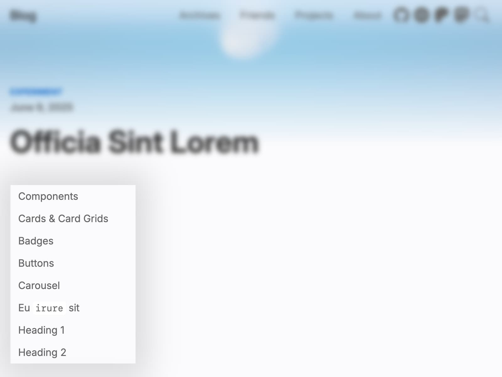

# Table of Contents

TOC is generated at client side, which won't be built into static files and requires JavaScript to operate.



TOC is enabled by default. If you wish it is disabled, set:

```yml filename="_config.cupertino.yml"
toc: false
```

By default, heading 1 and 2 are put into TOC. Max depth is alterable by modifying:

```yml filename="_config.cupertino.yml"
toc_max_depth: 2
```

All TOC items are with the same indention. It's not possible to change by configuring.
