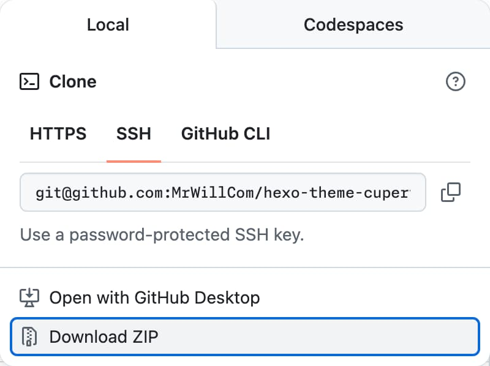

import { Steps, Tabs } from 'nextra/components'

# Installation

<Tabs items={['Package manager', 'Git submodule', 'Source code download']}>
  <Tabs.Tab>
    <Steps>
      Using package managers is the easiest way to get Theme Cupertino.

      ## Install Theme Cupertino as a dependency

      ```sh npm2yarn
      npm install hexo-theme-cupertino
      ```

      ## Switch to Theme Cupertino

      ```yaml filename="_config.yml"
      theme: cupertino
      ```
    </Steps>

  </Tabs.Tab>
  <Tabs.Tab>
    <Steps>
      Using Git submodule enables you to access the latest updates even earlier than the releases. You can also switch to any commit that you desire. To modify the theme, you may need to [fork the repository](https://docs.github.com/pull-requests/collaborating-with-pull-requests/working-with-forks/fork-a-repo) first.

      ## Add Theme Cupertino as a submodule

      ```sh
      git submodule add https://github.com/MrWillCom/hexo-theme-cupertino.git themes/cupertino
      ```

      ## Switch to Theme Cupertino

      ```yaml filename="_config.yml"
      theme: cupertino
      ```

      ## Install dependencies

      ```sh
      cd themes/cupertino
      ```

      ```sh npm2yarn
      npm install
      ```
    </Steps>

  </Tabs.Tab>
  <Tabs.Tab>
    <Steps>
      Downloading the source code may not receive updates, so it's not recommended for most users. However, for those who want to try out Theme Cupertino, this method best fits their needs.

      ## Download ZIP file

      Go to [GitHub](https://github.com/MrWillCom/hexo-theme-cupertino) to download [ZIP file of the source code](https://github.com/MrWillCom/hexo-theme-cupertino/archive/refs/heads/master.zip):

      

      After downloading, unzip it and put it in `themes/cupertino`.

      ## Switch to Theme Cupertino

      ```yaml filename="_config.yml"
      theme: cupertino
      ```

      ## Install dependencies

      ```sh
      cd themes/cupertino
      ```

      ```sh npm2yarn
      npm install
      ```
    </Steps>

  </Tabs.Tab>
</Tabs>
