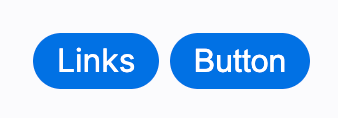
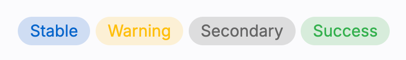
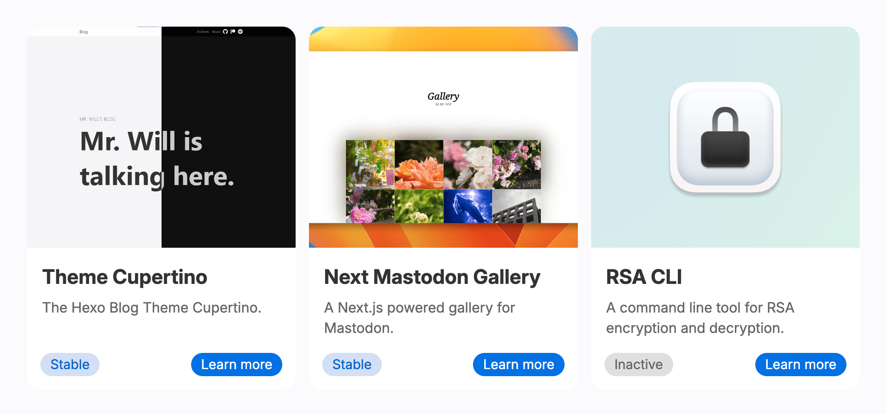
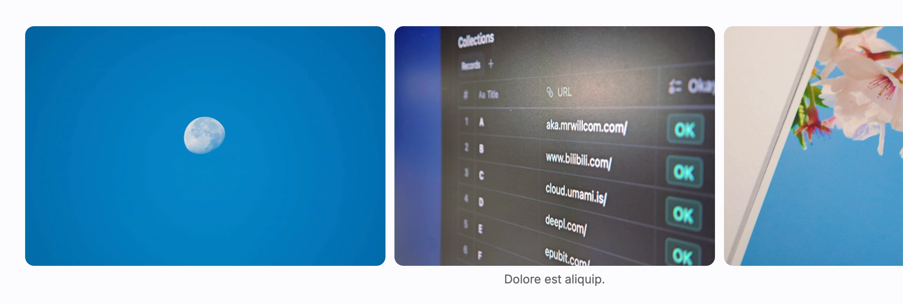
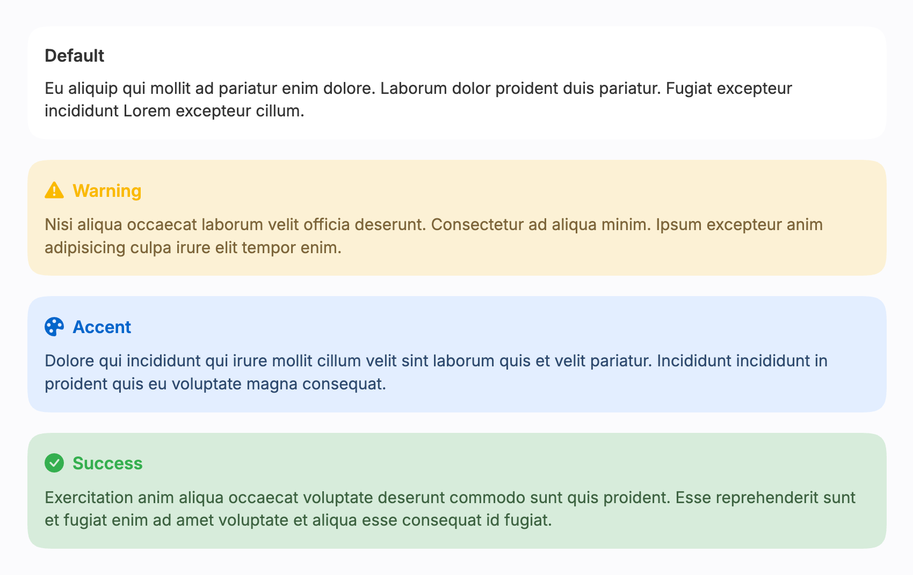

import { Cards } from 'nextra/components'
import { Component } from 'lucide-react'

# Use Built-in Components

All built-in components are enabled by default, so they are ready out-of-box. Further configuration can be found:

<br />

<Cards.Card
  icon={<Component />}
  title="Built-in Components"
  href="/config/builtin-components"
  arrow
/>

## Container

By default, everything in the main part has no margin or padding to the viewport's edge. This allows you to create wide content without being restricted by a fixed width. So you have to use `.container` to bring margin and padding back:

```html
<div class="container">
  <!-- your content here -->
</div>
```

## Button

Both links and buttons can be shaped into a button's appearance:



```html
<a class="action-button-primary" href="#">Links</a>
<button class="action-button-primary">Button</button>
```

## Badge



```html
<span class="badge">Stable</span>
<span class="badge warning">Warning</span>
<span class="badge secondary">Secondary</span>
<span class="badge success">Success</span>
```

## Cards & Card Grids

Card grids can help you place multiple cards. Cards presents information of an item clearly.



{/* Spaces in the empty line are for line spacing */}

```nunjucks showLineNumbers
















<span class="badge">Stable</span>



<a class="action-button-primary" href="https://rsa.js.org/">Learn more</a>
<button class="action-button-primary">Button</button>







```

## Carousel

Carousel contains photos and allow visitors to scroll and view.



```html
<div class="carousel">
  
  <figure>
    
    <figcaption>Dolore est aliquip.</figcaption>
  </figure>
  
  
</div>
```

## Callout

Callouts are used to highlight important information.



```html
<htc-callout>
  <span slot="title">Default</span>
  Your content goes here.
</htc-callout>
<htc-callout type="warning">
  <span slot="icon"><i class="bi bi-exclamation-triangle-fill"></i></span>
  <span slot="title">Warning</span>
  Your content goes here.
</htc-callout>
<htc-callout type="accent">
  <span slot="icon"><i class="bi bi-palette-fill"></i></span>
  <span slot="title">Accent</span>
  Your content goes here.
</htc-callout>
<htc-callout type="success">
  <span slot="icon"><i class="bi bi-check-circle-fill"></i></span>
  <span slot="title">Success</span>
  Your content goes here.
</htc-callout>
```

## Utilities

### `.block-large`

Add `class="block-large"` to the block elements that you want to allow it a wider container. The large blocks will be wider than the article if the viewport allows.

### `.no-select`

Prevents visitors from selecting texts. But note, the users still can access the unselectable text in DevTools.

### `.text-left`, `-center`, `-right`

Used for customizing text alignment, useful if you're placing headings.

### `.text-uppercase`, `-lowercase`, `-capitalize`

Used for transforming letters.
