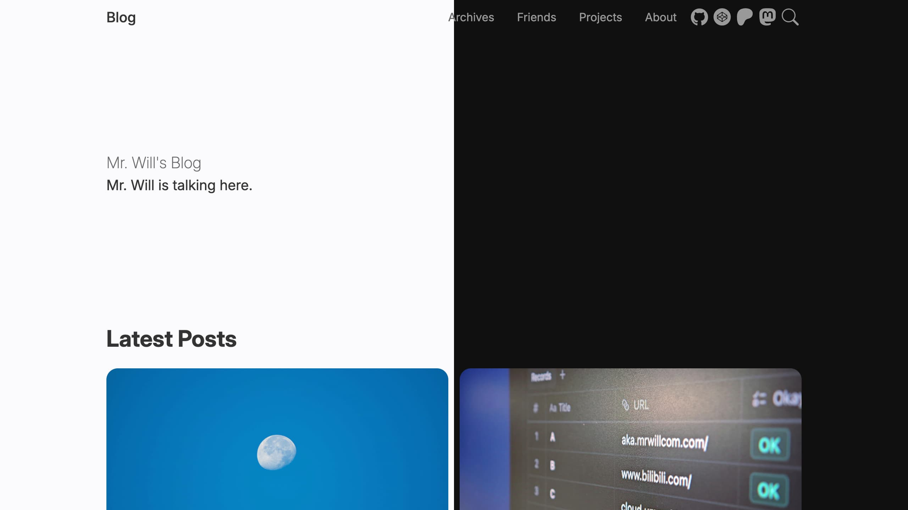

import { Callout } from 'nextra/components'

# Introduction

Hexo Theme Cupertino is a modern and elegant theme for your [Hexo](https://hexo.io/) blog, which is beautifully designed and has gorgeous details. It's based on Cupertino Design, so it looks similar to [Apple Newsroom](https://www.apple.com/newsroom).

With Theme Cupertino, your blogging experience will be hugely elevated, and your ideas can be shared in an effortless way.

<Callout>
  If you don't have a Hexo blog, follow [Hexo docs](https://hexo.io/docs/) and
  create your own today.
</Callout>

Let's [get started](/get-started) now.

import { Cards } from 'nextra/components'

import { Rocket, PlaneTakeoff } from 'lucide-react'

<Cards>
  <Cards.Card icon={<Rocket />} title="Get Started" href="/get-started" arrow />
  <Cards.Card
    icon={<PlaneTakeoff />}
    title="Migrate from v1"
    href="/guides/migrate-from-v1"
  />
</Cards>
