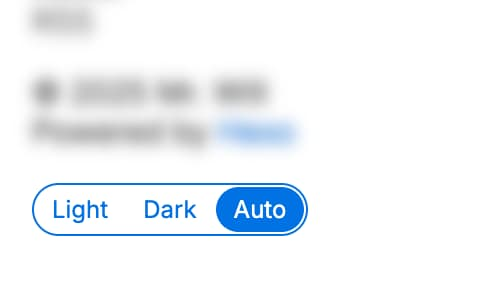

# 配色方案

## 配色方案

使用哪种配色方案，取值应为 `light`、`dark` 和 `auto` 之一。默认值为 `auto`。

```yml filename="_config.cupertino.yml"
color_scheme: auto
```

## 配色方案切换

在页脚显示配色主题切换按钮。



```yml filename="_config.cupertino.yml"
show_color_scheme_toggle: true
```
