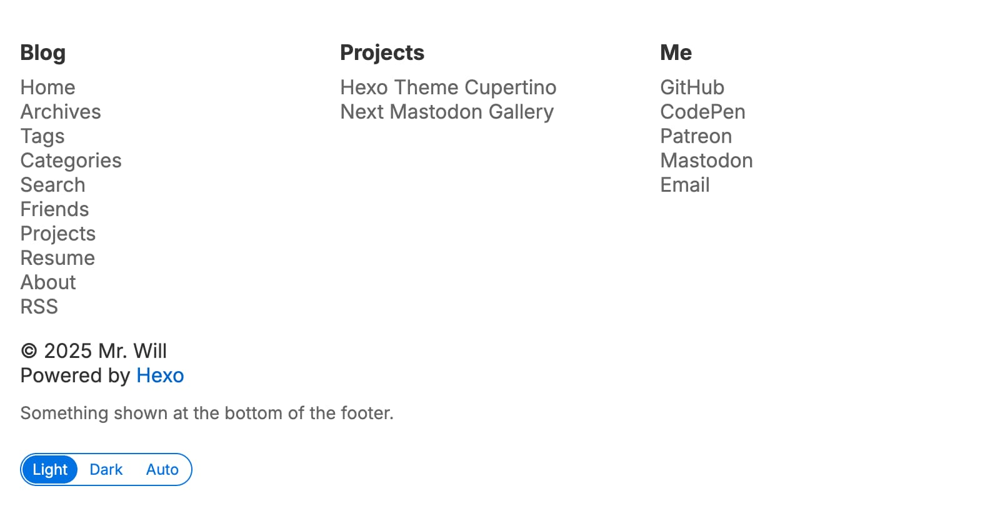

# 页脚



## 链接

默认情况下，页脚包含 3 列链接，每列都有一个标题。你可以通过添加或删除页脚分组来增删列，页脚分组的总数没有限制。

```yml filename="_config.cupertino.yml"
footer:
  - group_name: Blog
    items:
      - name: Home
        url: /
      - name: Archives
        url: /archives
      ...
      - name: RSS
        url: /atom.xml
  - group_name: Projects
    items:
      ...
  - group_name: Me
    items:
      - name: Email
        url: mailto:somebody@example.com
```

## 附加描述

如果需要在页脚追加你的 ICP 备案号或一些随性文字，请使用 `footer_extra_description`。该配置会原样输出其值。

```yml filename="_config.cupertino.yml"
footer_extra_description: 显示在页脚底部的内容。
```
