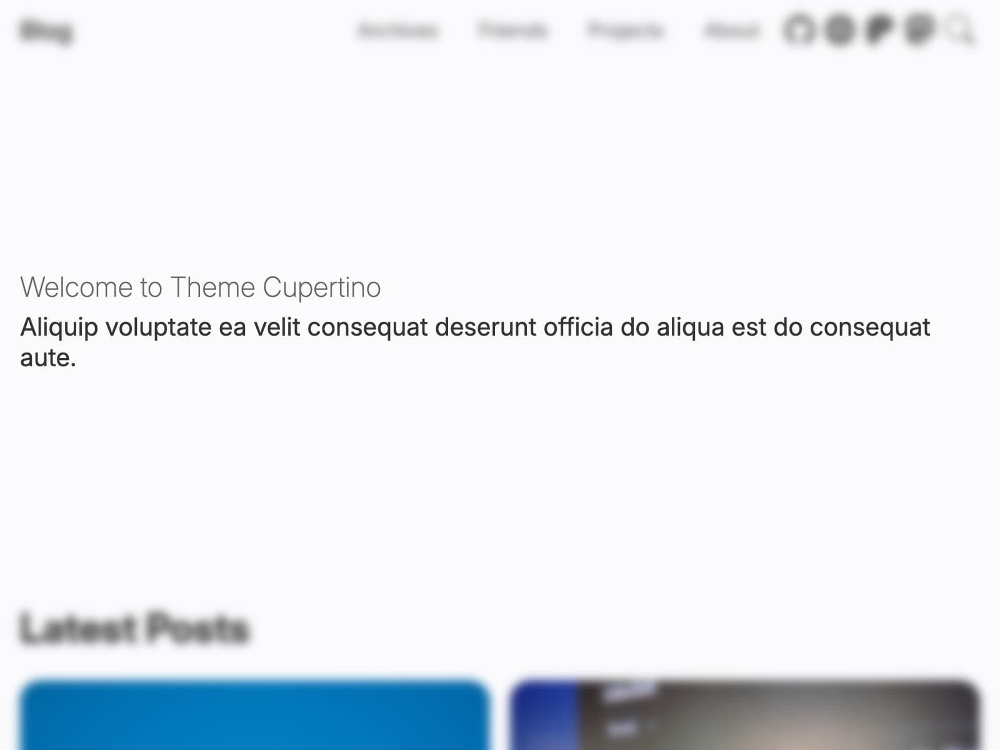

# 首屏区域

博客首页的第一个区域。



```yml filename="_config.cupertino.yml"
hero:
  title: 欢迎使用 Cupertino 主题
  description: |
    Aliquip voluptate ea velit consequat deserunt officia do aliqua est do consequat aute.
```

`hero.description` 支持多行内容，并会保留换行。
