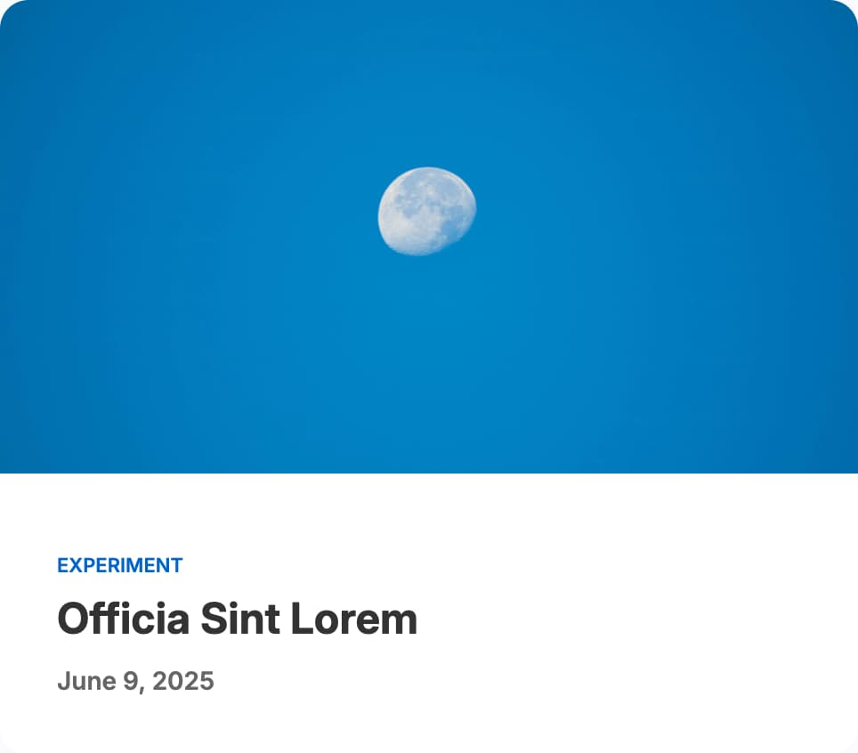
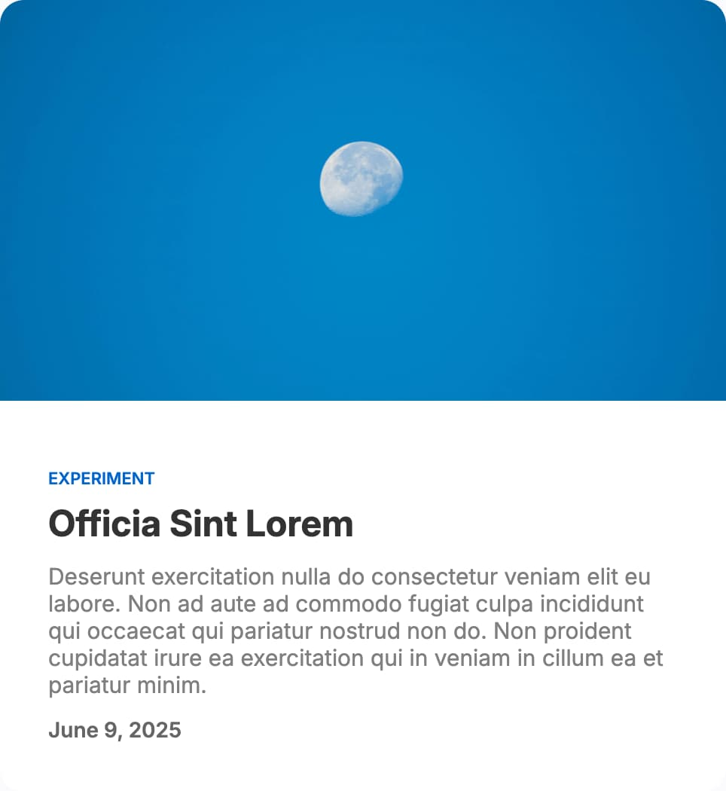
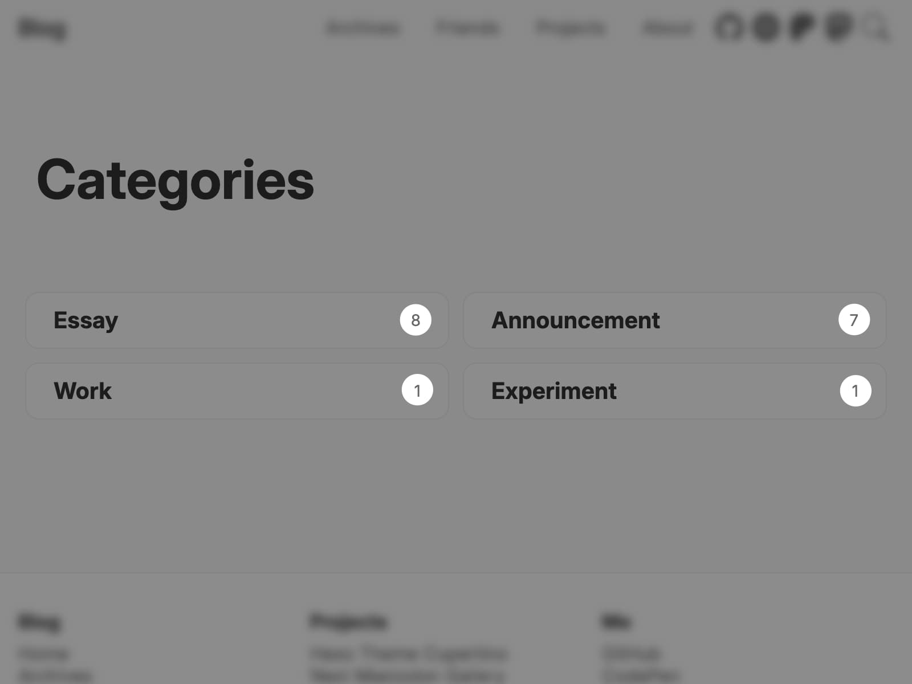
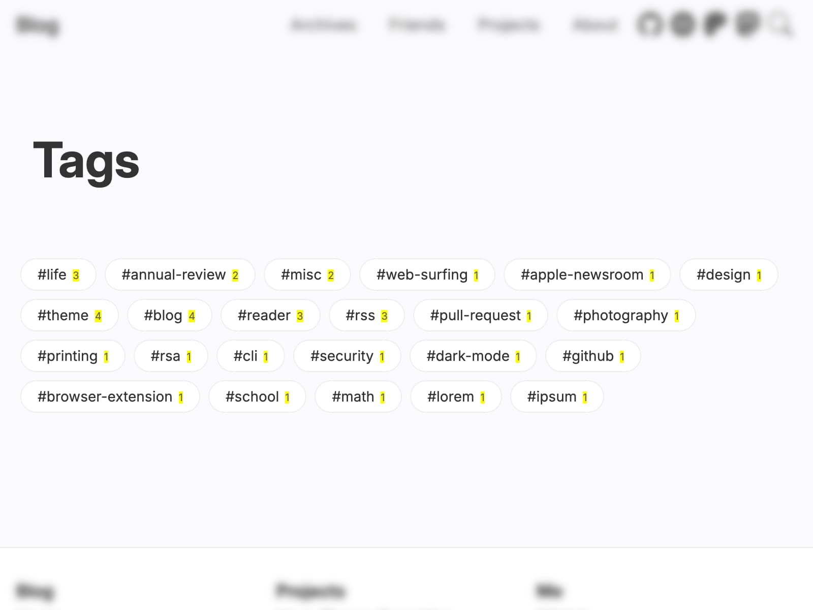

# 文章

## 摘要

| 隐藏摘要                                                               | 显示摘要                                                             |
| ---------------------------------------------------------------------------- | ------------------------------------------------------------------------- |
|  |  |

摘要默认隐藏。要启用它，请设置：

```yml filename="_config.cupertino.yml"
show_excerpt: true
```

## 标签与分类外观

### 分类大写

是否将分类名称转为大写。该选项会影响文章列表、文章页面等处显示的分类，但不包括分类页。

```yml filename="_config.cupertino.yml"
uppercase_categories: true
```

### 分类文章数



是否在分类页显示文章数量。

```yml filename="_config.cupertino.yml"
categories_post_count: true
```

### 标签首字母大写

是否将标签名称首字母大写。

```yml filename="_config.cupertino.yml"
capitalize_tags: false
```

### 标签前的井号前缀

自动为标签名称添加井号前缀。

```yml filename="_config.cupertino.yml"
hashtag_prefix_before_tags: true
```

### 标签文章数

黄色背景的即为文章数量。



是否在标签页显示文章数量。

```yml filename="_config.cupertino.yml"
tags_post_count: true
```
