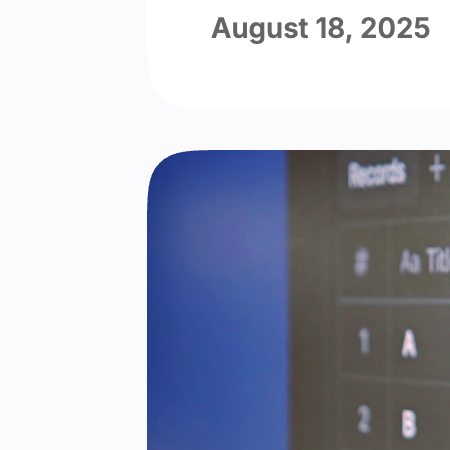

# Squircle 圆角

Squircle 圆角将所有圆角变成圆角矩形（squircle）形状而非圆弧，带来现代而流畅的观感。

import { Tabs } from 'nextra/components'

<Tabs items={['启用 Squircle 圆角', '禁用 Squircle 圆角']}>
  <Tabs.Tab>
    
  </Tabs.Tab>
  <Tabs.Tab>
    
  </Tabs.Tab>
</Tabs>

由于 Squircle 圆角使用 `@support` 来确保兼容性，它默认启用。

```yml filename="_config.cupertino.yml"
squircle: true
```
