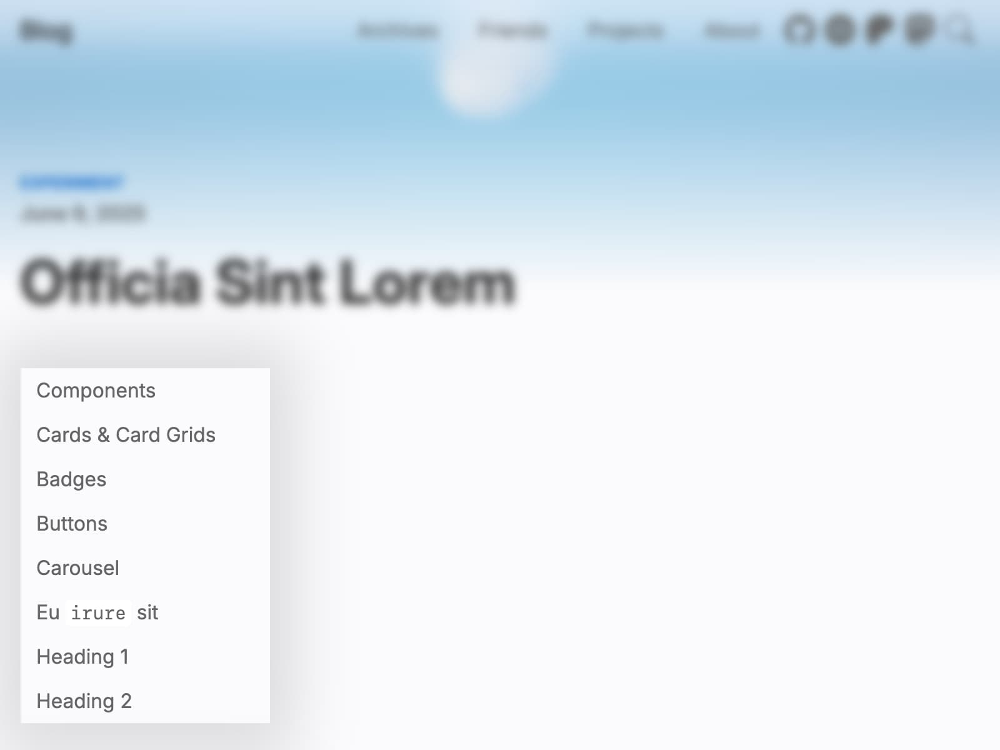

# 目录

目录在客户端生成，不会构建进静态文件，需要 JavaScript 才能运行。



目录默认开启。如果你希望关闭它，请设置：

```yml filename="_config.cupertino.yml"
toc: false
```

默认情况下，一级和二级标题会放入目录。最大深度可以通过修改以下配置调整：

```yml filename="_config.cupertino.yml"
toc_max_depth: 2
```

所有目录项具有相同的缩进，无法通过配置更改。
