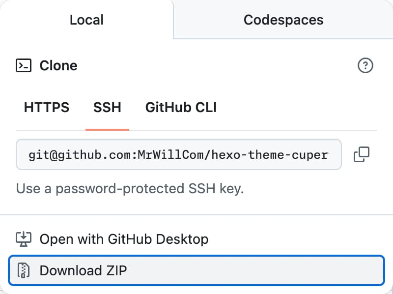

import { Steps, Tabs, Callout, Cards } from 'nextra/components'

# 快速开始

<Callout type="info">
  如果你正从 v1 升级，请阅读[从 v1 迁移](/guides/migrate-from-v1)。
</Callout>

<Tabs items={['包管理器', 'Git 子模块', '下载源码']}>
  <Tabs.Tab>
    <Steps>
      使用包管理器是获取 Cupertino 主题最简单的方式。

      ## 将 Cupertino 主题安装为依赖

      ```sh npm2yarn
      npm install hexo-theme-cupertino
      ```

      ## 切换到 Cupertino 主题

      ```yaml filename="_config.yml"
      theme: cupertino
      ```
    </Steps>

  </Tabs.Tab>
  <Tabs.Tab>
    <Steps>
      使用 Git 子模块可以比正式发布更早地获取最新更新，你也可以切换到任意提交。若要修改主题，你可能需要先[fork 仓库](https://docs.github.com/pull-requests/collaborating-with-pull-requests/working-with-forks/fork-a-repo)。

      ## 将 Cupertino 主题添加为子模块

      ```sh
      git submodule add https://github.com/MrWillCom/hexo-theme-cupertino.git themes/cupertino
      ```

      ## 切换到 Cupertino 主题

      ```yaml filename="_config.yml"
      theme: cupertino
      ```

      ## 安装依赖

      ```sh
      cd themes/cupertino
      ```

      ```sh npm2yarn
      npm install
      ```
    </Steps>

  </Tabs.Tab>
  <Tabs.Tab>
    <Steps>
      下载源码不会自动接收更新，因此不推荐大多数用户使用。不过，对于想先试试 Cupertino 主题的用户来说，这种方式最合适。

      ## 下载 ZIP 文件

      前往 [GitHub](https://github.com/MrWillCom/hexo-theme-cupertino) 下载[源码的 ZIP 文件](https://github.com/MrWillCom/hexo-theme-cupertino/archive/refs/heads/master.zip)：

      

      下载完成后，解压并放入 `themes/cupertino`。

      ## 切换到 Cupertino 主题

      ```yaml filename="_config.yml"
      theme: cupertino
      ```

      ## 安装依赖

      ```sh
      cd themes/cupertino
      ```

      ```sh npm2yarn
      npm install
      ```
    </Steps>

  </Tabs.Tab>
</Tabs>
