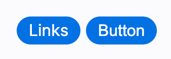
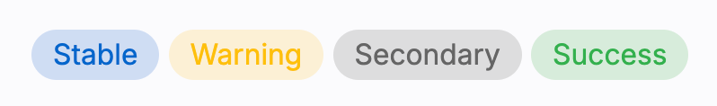
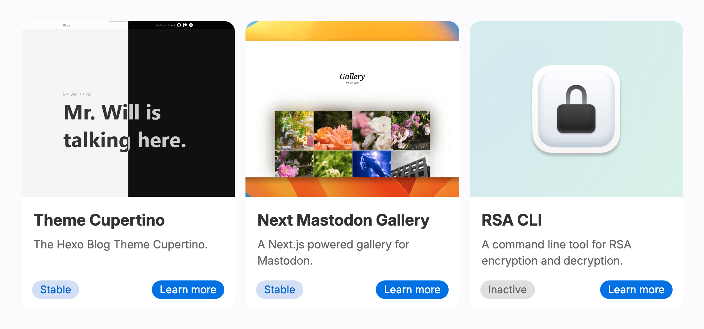
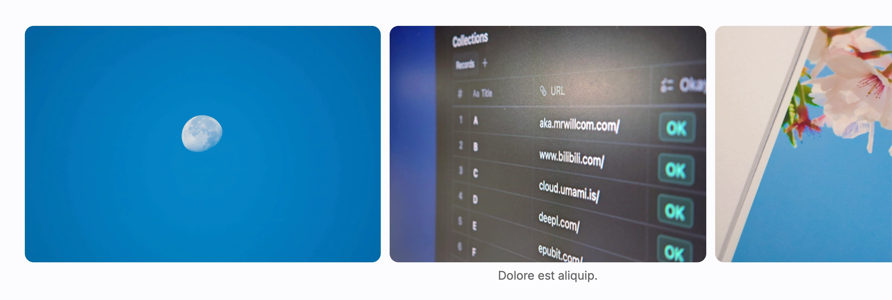
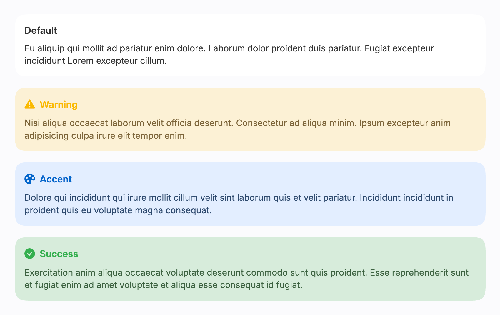

import { Cards } from 'nextra/components'
import { Component } from 'lucide-react'

# 使用内置组件

所有内置组件默认启用，开箱即用。更多配置请参阅：

<br />

<Cards.Card
  icon={<Component />}
  title="内置组件"
  href="/config/builtin-components"
  arrow
/>

## 容器（Container）

默认情况下，主体部分的内容与视口边缘之间没有任何外边距或内边距。这样你可以制作不受固定宽度限制的宽幅内容。因此，你需要使用 `.container` 来恢复外边距和内边距：

```html
<div class="container">
  <!-- 你的内容 -->
</div>
```

## 按钮（Button）

链接和按钮都可以呈现为按钮的外观：



```html
<a class="action-button-primary" href="#">链接</a>
<button class="action-button-primary">按钮</button>
```

## 徽章（Badge）



```html
<span class="badge">Stable</span>
<span class="badge warning">Warning</span>
<span class="badge secondary">Secondary</span>
<span class="badge success">Success</span>
```

## 卡片与卡片网格（Cards & Card Grids）

卡片网格可以帮助你放置多张卡片。卡片可以清晰地展示条目的信息。



{/* 空行中的空格用于行距 */}

```nunjucks showLineNumbers
















<span class="badge">Stable</span>



<a class="action-button-primary" href="https://rsa.js.org/">了解更多</a>
<button class="action-button-primary">按钮</button>







```

## 轮播（Carousel）

轮播包含照片，访客可以滚动浏览。



```html
<div class="carousel">
  
  <figure>
    
    <figcaption>Dolore est aliquip.</figcaption>
  </figure>
  
  
</div>
```

## 提示框（Callout）

提示框用于突出显示重要信息。



`icon` 和 `title` 都是可选的。

```html
<htc-callout>
  <span slot="title">默认</span>
  你的内容写在这里。
</htc-callout>
<htc-callout type="warning">
  <span slot="icon"><i class="bi bi-exclamation-triangle-fill"></i></span>
  <span slot="title">警告</span>
  你的内容写在这里。
</htc-callout>
<htc-callout type="accent">
  <span slot="icon"><i class="bi bi-palette-fill"></i></span>
  <span slot="title">强调</span>
  你的内容写在这里。
</htc-callout>
<htc-callout type="success">
  <span slot="icon"><i class="bi bi-check-circle-fill"></i></span>
  <span slot="title">成功</span>
  你的内容写在这里。
</htc-callout>
```

## 工具类（Utilities）

### `.block-large`

为希望获得更宽容器的块级元素添加 `class="block-large"`。在视口允许的情况下，大块内容会比文章更宽。

### `.no-select`

阻止访客选中文本。但请注意，用户仍然可以在 DevTools 中访问这些不可选中的文本。

### `.text-left`、`.text-center`、`.text-right`

用于自定义文本对齐，放置标题时很有用。

### `.text-uppercase`、`.text-lowercase`、`.text-capitalize`

用于转换字母大小写。
