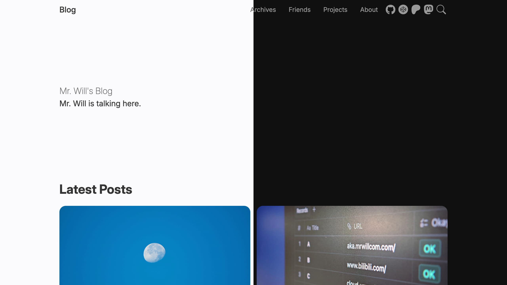

import { Callout } from 'nextra/components'

# 简介

Hexo Theme Cupertino 是一个现代化、优雅的 [Hexo](https://hexo.io/) 博客主题，设计精美、细节出众。它基于 Cupertino 设计语言，外观与 [Apple Newsroom](https://www.apple.com/newsroom) 相似。

使用 Cupertino 主题，你的博客体验将得到大幅提升，想法也能被轻松地分享出去。

<Callout>
  如果你还没有 Hexo 博客，请阅读 [Hexo 文档](https://hexo.io/docs/) 并立即创建一个。
</Callout>

让我们[开始](/get-started)吧。

import { Cards } from 'nextra/components'

import { Rocket, PlaneTakeoff } from 'lucide-react'

<Cards>
  <Cards.Card icon={<Rocket />} title="快速开始" href="/get-started" arrow />
  <Cards.Card
    icon={<PlaneTakeoff />}
    title="从 v1 迁移"
    href="/guides/migrate-from-v1"
  />
</Cards>
