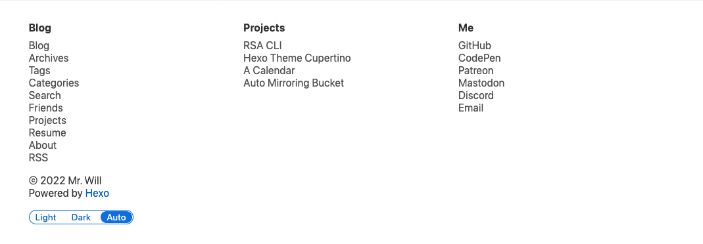

# Footer

Quick links shows at the end of your site.



Syntax:

```yaml
footer:
  <section-title>:
    <name>: <link>
    ...
  ...
```

Example:

```yaml
footer:
  Blog:
    Blog: /
    Archives: /archives
    Tags: /tags
    Categories: /categories
    Search: /search
    Friends: /friends
    Projects: /projects
    Resume: /resume
    About: /about
    RSS: /atom.xml
  Projects:
    Hexo Theme Cupertino: https://github.com/MrWillCom/hexo-theme-cupertino
    RSA CLI: https://github.com/MrWillCom/rsa-cli
  Me:
    GitHub: https://github.com/MrWillCom
```
