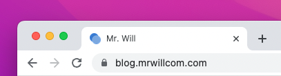

# Metadata

## Favicon

Favicon is the icon displayed on the browser tab.



```yaml title="theme/hexo-theme-cupertino/_config.yml"
favicon: <path-to-favicon>
```

## Manifest

Manifest is mostly used for PWA, Check [MDN](https://developer.mozilla.org/docs/Web/Manifest) for details.

```yaml title="theme/hexo-theme-cupertino/_config.yml"
manifest: <path-to-manifest>
```
