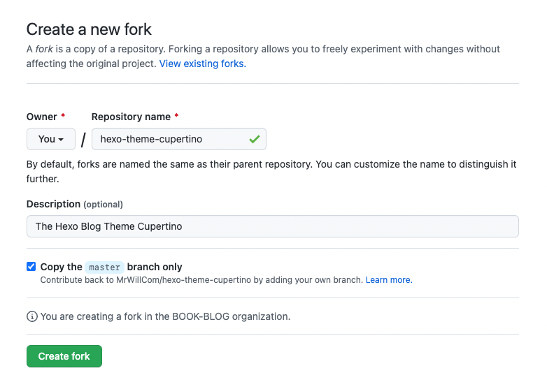

# Installation

## Create a Fork

For future configuration, you should create a fork of the theme.



## Clone your Fork

```bash
$ git clone https://github.com/<username>/hexo-theme-cupertino.git themes/cupertino
```

## Switch to Theme Cupertino

```yaml title="_config.yaml"
theme: cupertino
```
