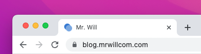

# Metadata

## Favicon

Favicon is the icon displayed on the browser tab.



```yaml filename="_config.cupertino.yml"
favicon: <path-to-favicon>
```

## Manifest

Manifest is mostly used for PWA, check [MDN](https://developer.mozilla.org/docs/Web/Manifest) for details.

```yaml filename="_config.cupertino.yml"
manifest: <path-to-manifest>
```
