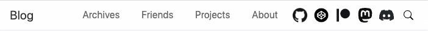

# Navigation

Quick links shows at the top of your site.



```yaml filename="theme/hexo-theme-cupertino/_config.yml"
nav:
  title: Blog
  items:
    Archives: /archives
    Friends: /friends
    Projects: /projects
    About: /about
    GitHub: https://github.com/MrWillCom
    CodePen: https://codepen.io/mrwillcom
    Patreon: https://www.patreon.com/MrWillCom
    Mastodon: https://noc.social/@MrWillCom
    Discord: https://discord.gg/UKuFDjcfY8
    Search: /search
```

`nav.title` displays in the top left corner of the navigation and gives a link to the home of the site.

`nav.items` is the rest links. Syntax is like this: `<name>:<link>`. Some links will be automatically turned into icons, including `GitHub`, `CodePen`, `Patreon`, `Mastodon`, `Discord` and `Search`.
