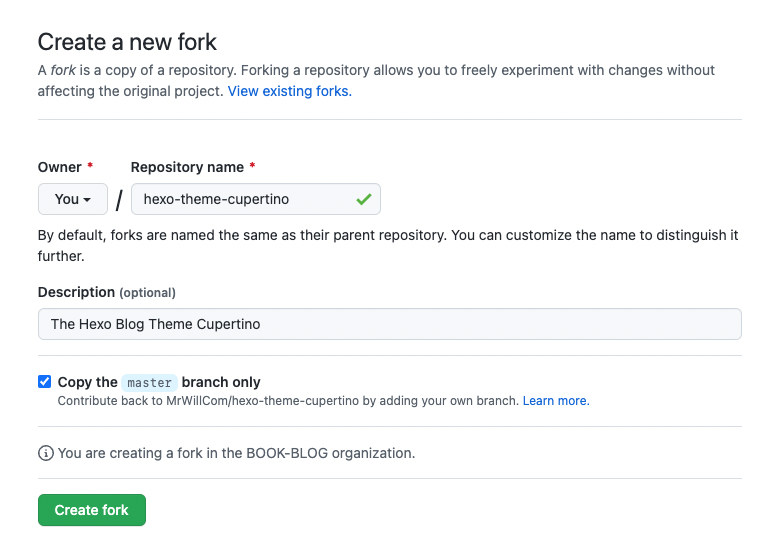

import { Steps } from 'nextra/components'

# Installation

<Steps>
### Create a Fork

In order to make future modifications and edit configuration, you should create a fork of the theme.



### Clone your Fork

```sh
> git clone https://github.com/<username>/hexo-theme-cupertino.git themes/cupertino
```

### Switch to Theme Cupertino

```yaml filename="_config.yml"
theme: cupertino
```
</Steps>
