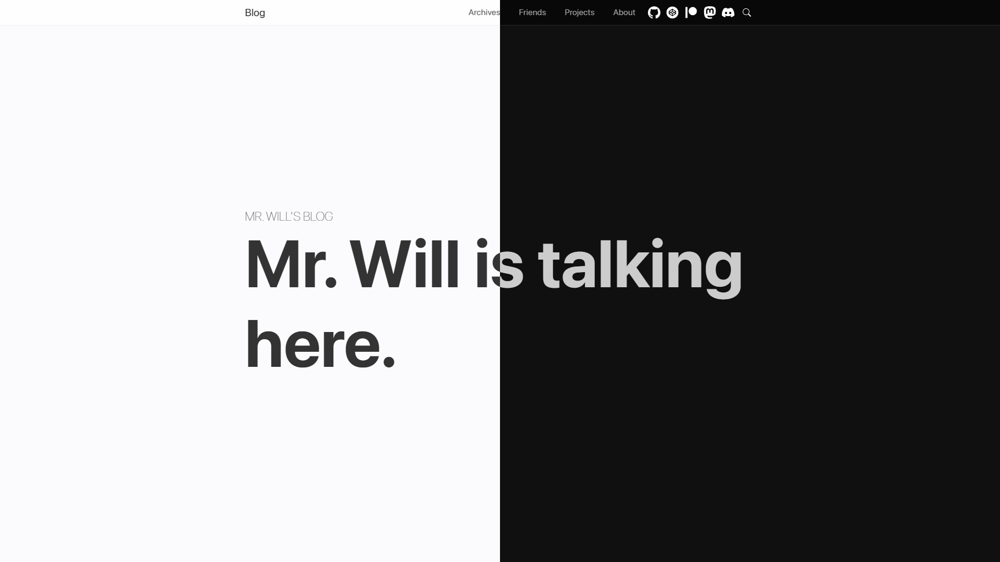

import { Callout } from 'nextra/components'

# Introduction

Hexo Theme Cupertino is a simple, fluent and elegant theme for [Hexo](https://hexo.io/) blogs.

It has a gorgeous design, based on Apple Cupertino Design. And enables you to show your posts in the best way.

<Callout emoji="💡">
  Follow [Hexo's docs](https://hexo.io/docs/) and create your own today!
</Callout>

So, [get started](/getting-started/installation) now.
